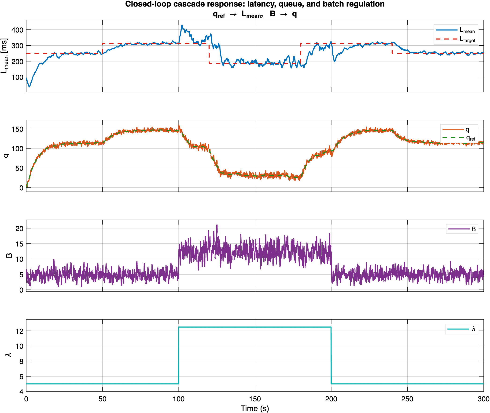
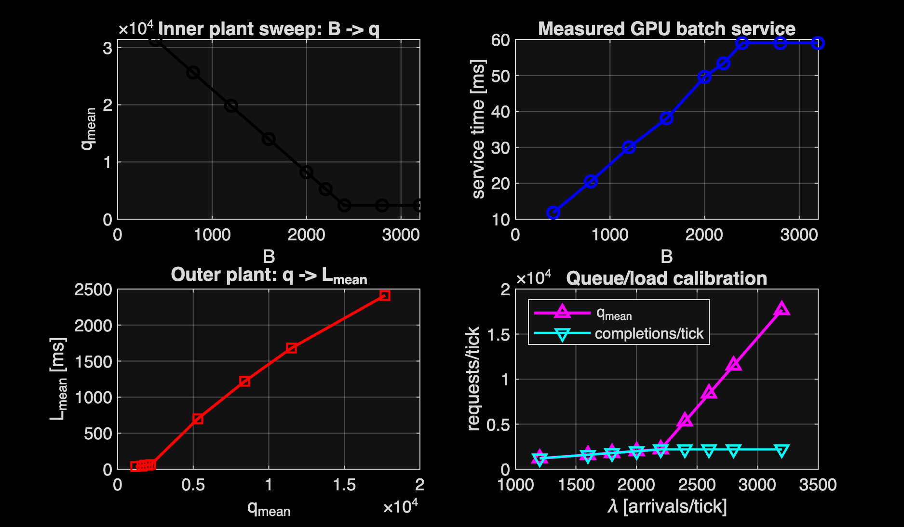
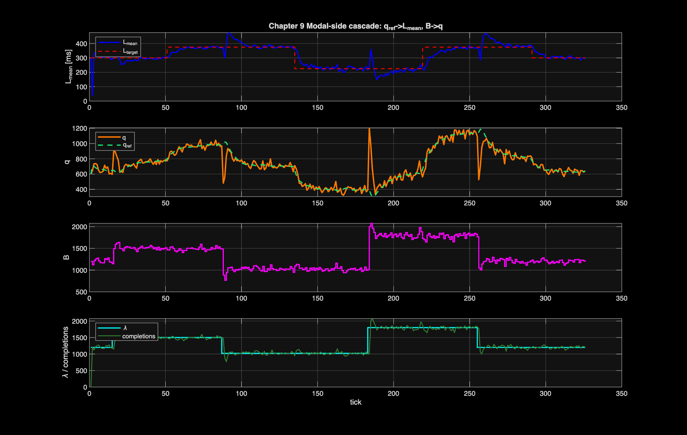

# LLM Inference Control

A learning project applying classical control theory to LLM inference serving systems. Nine chapters, two successes, and seven increasingly educational failures.

The recurring lesson: characterising the plant is the most important step in control design. The control law was never wrong — it was being applied at the wrong layer of the stack. I did not know the right abstraction until I measured.

**Blog post:** [Applying Classical Control Theory to LLM Inference Serving](https://vasudevanhari.substack.com/)

---

## Chapter map

| # | Plant | Architecture | Outcome |
|---|-------|-------------|---------|
| [1](chapter_1/) | Simulated (MATLAB) | Single-loop LQR + pole placement | **Works** — proof of concept in simulation |
| [2](chapter_2/) | Simulated (MATLAB) | Cascade (inner: B→q, outer: q_ref→l_p95) | **Works** — cascade verified in simulation |
| [2a](chapter_2a/) | Simulated (MATLAB) | Cascade with model-based integrator | **Broke** — feedthrough term causes integrator windup, system latches to wrong equilibrium |
| [3](chapter_3/) | Real Ollama on M-Mac (qwen2.5:3b) | Cascade attempt | **Broke** — q≈0 always; Ollama has no persistent queue, OS schedules immediately; inner loop regulates a non-existent state |
| [4](chapter_4/) | Real Ollama on M-Mac (qwen2.5:3b) | Single-loop integral on TTFT | **Works** — abandoned cascade, B controls TTFT via GPU concurrency directly |
| [5](chapter_5/) | vLLM on Apple Silicon (Qwen3-0.6B) | Cascade attempt | **Broke** — two failures: (1) vLLM-metal `num_requests_waiting` gauge is broken (accumulates monotonically, never decrements), (2) software FIFO queue is useless because vLLM dispatches in the same tick requests arrive |
| [6](chapter_6/) | Intel Mac queue server (qwen2.5:0.5b) | Single-loop integral on TTFT | **Partial** — real queue works, but CPU time-slices instead of batching so cascade is still invalid; also discovered l_total as control signal is unstable (sign flips at high q) |
| [7](chapter_7/) | Modal + native vLLM on NVIDIA T4 | Remote single-loop / characterization | **Partial** — remote GPU path works, but serverless overhead hides clean queue signal; vLLM queue stays near zero |
| [8](chapter_8/) | Modal wrapper queue + vLLM on NVIDIA T4 | MATLAB cascade attempt | **Broke** — outer fit gives negative slope `l_mean = -4.92·q + 649`, physically impossible; top-level LLM latency is too entangled to expose the cascade plant |
| [9](chapter_9/) | Modal lower-level GPU batching plant | Chapter 2 cascade (inner: B→q, outer: q_ref→L_mean) | **Works** — exact batch-size actuator, real carry-over backlog, measured GPU service time; cascade regulates latency |

### What broke and why

**Chapter 2a — integrator windup in simulation.** The model-based integrator predicted what the error *should* be rather than accumulating the measured error. A large feedthrough term caused the integrator to wind up and trap the system at the wrong equilibrium. Fix: use measurement-based integration.

**Chapter 3 — no queue exists.** Ollama (and most LLM serving frameworks in default configuration) does not maintain a persistent queue with backpressure. The OS schedules incoming requests into GPU threads immediately. Queue depth is always zero. The cascade inner loop was regulating a state variable that did not exist on this hardware.

**Chapter 5 — broken metrics and useless queue.** Two independent failures on vLLM's Apple Metal backend. The Prometheus `num_requests_waiting` gauge has a bug: it increments on arrival but never decrements on dispatch. And a software FIFO workaround was pointless because vLLM dispatches requests in the same tick they arrive — queue wait is always near-zero.

**Chapter 8 — wrong layer of the stack.** Even with a real wrapper FIFO and explicit per-tick batch dispatch on a GPU, the top-level LLM latency signal is too aggregated. The outer-loop identification gave `l_mean(q) = -4.9228·q + 648.76` — a negative slope, meaning more queue implies less latency. That is not a credible queueing law. The latency signal was contaminated by vLLM's internal scheduler, request streaming, KV-cache management, and per-request variability. The Chapter 2 equations are lower-level scheduling equations, not whole-LLM-API equations.

---

## Architecture

```
Chapter 1–2: Simulation only
    MATLAB controller ──► simulated plant (llm_plant.m)

Chapter 3–4: Real hardware (M-Mac)
    MATLAB/Simulink ──► Ollama HTTP ──► GPU (Apple Silicon)

Chapter 5: vLLM on Apple Silicon  [abandoned — broken Prometheus metrics]
    Python controller ──► vLLM REST ──► GPU (Metal)

Chapter 6: Real queue server (Intel Mac)
    MATLAB controller ──► queue_server.py HTTP ──► Ollama ──► CPU
    (controller on M-Mac, server on Intel Mac at 192.168.68.106:8002)

Chapter 7–9: Remote GPU experiments on Modal
    MATLAB controller ──► Modal wrapper / vLLM ──► NVIDIA GPU
    Chapter 7: native remote serving characterization
    Chapter 8: wrapper queue + MATLAB cascade attempt  [failed — wrong layer]
    Chapter 9: lower-level GPU batching plant with exact B actuator  [success]
```

---

## Key learnings by chapter

**Ch1 → Ch2:** The cascade architecture (separate inner queue loop + outer latency loop) works cleanly in simulation because batch size B independently controls both queue drain rate and per-request latency.

**Ch2a:** Model-based integrators with feedthrough cause windup. Integrate what you measure, not what your model predicts.

**Ch3:** On real hardware without backpressure, the queue is always near zero — the OS schedules requests immediately. The cascade inner loop has nothing to regulate. Characterise the plant *before* designing the controller.

**Ch4:** Single-loop integral on TTFT is the right architecture when the queue is always empty. B → TTFT is a stable monotone relationship on a GPU.

**Ch5:** vLLM's Apple Metal backend has a Prometheus metric bug (`num_requests_waiting` never decrements). Software FIFO queues don't help because requests are dispatched in the same tick they arrive. If you want a real queue, you have to build your own scheduler.

**Ch6:** With a real queue server, `l_total = queue_wait + TTFT`. Using `l_total` as the control signal inverts the control sign at high queue depth (reducing B increases queue_wait faster than it reduces TTFT — positive feedback). Must use TTFT-only as the control signal. The cascade is still not valid on Intel CPU because the CPU time-slices requests rather than batching them — service rate barely changes with B.

**Ch7:** A real remote NVIDIA/vLLM path is operational, but a serverless-style deployment still does not expose the clean queue signal needed for the cascade. Large fixed latency floor from container/network overhead.

**Ch8:** Even with a wrapper FIFO and explicit per-tick batch dispatch on a real GPU, the top-level LLM latency signal is too aggregated. The negative outer slope (`l_mean = -4.92·q + 649`) is the clearest possible signal that you're measuring the wrong plant.

**Ch9:** Moving one level down to a fixed GPU tensor workload exposes the Chapter 2 plant directly. Batch size `B` is an exact actuator, `q` is the carry-over FIFO backlog after dispatch, and service time is measured per batch. The cascade regulates latency. Caveats: the quadratic service-time coefficient was negligible at this scale (nearly linear in B), and total latency contains a service-time component that the pure `β·q` model does not capture.

---

## Results

### Chapter 2 closed-loop cascade (simulation)



### Chapter 9 open-loop characterisation



### Chapter 9 closed-loop cascade



---

## Repo structure

```
chapter_1/          Simulation: LQR + pole placement
  src/              MATLAB scripts (setup_plant.m, design_controller.m, ...)
  simulink_model/   Simulink .slx model
  results_*.png     Final result plots

chapter_2/          Simulation: cascade controller
  src/
  simulink_model/

chapter_2a/         Simulation: cascade with model-based integrator (broke)
  src/
  simulink_model/

chapter_3/          Real Ollama: cascade attempt (broke — q≈0)
  src/
  identification/   Plant identification scripts
  simulink_model/

chapter_4/          Real Ollama: single-loop integral (success)
  src/
  identification/
  simulink_model/

chapter_5/          vLLM Apple Silicon: cascade attempt (broke — bad metrics)
  python/           Python controller + characterise/design scripts
  start_vllm.sh

chapter_6/          Intel Mac queue server: single-loop on TTFT
  server/           queue_server.py + setup.sh (runs on Intel Mac)
  matlab/           characterise.m, design_controller.m, run_controller.m
  README.md

chapter_7/          Modal native vLLM remote experiment
  README.md

chapter_8/          Modal wrapper queue + MATLAB cascade (broke — wrong layer)
  modal_vllm_wrapper.py
  remote/
  matlab/
  README.md

chapter_9/          Modal lower-level GPU batching cascade (success)
  modal_gpu_batch_server.py
  python/
  matlab/
  README.md
```
