# Chapter 11: Token Throughput Control for LLM Serving

## Background

Chapter 10 attempted to insert a classical queue-wait controller at vLLM's
GPU batch scheduling level. The actuator worked (capping `max_num_scheduled_tokens`
genuinely constrains tokens per step), but the feedback variable failed:
vLLM's continuous batching scheduler processes waiting requests at GPU step
frequency (~100+ times/sec), so queue wait is always ~0ms regardless of the
token budget. There is no queue to control.

The key finding: **at the continuous-batching scheduler level, the plant
dynamics are token-throughput-based, not queue-based.** The token budget
directly shapes TTFT, throughput, and GPU power.

## This Chapter

We redesign the controller to regulate the variables that actually respond
to the token budget actuator:

1. **Constant-TTFT controller** — set a TTFT target (e.g., 200ms), and the
   controller adjusts the token budget to maintain it under varying load.

2. **Constant-power controller** — set a GPU power target (e.g., 65W), and
   the controller adjusts the token budget to stay within the power envelope.

Both controllers share the same inner actuator: the `schedule()` override
that caps `max_num_scheduled_tokens` and `max_num_running_reqs`.

Phase 2 and 3 use a **dispatch-delay actuator** instead of token-budget
for TTFT regulation: `time.sleep(delay_s)` before each request send. This
gives a positive-gain, high-authority plant with no vLLM scheduler coupling.

---

## System Architecture

```
  ┌───────────────────────────────────────────────────────────────────────┐
  │  Modal Container  (NVIDIA T4 GPU, 16GB)                               │
  │                                                                       │
  │   ┌───────────────────────────────────┐   ┌────────────────────────┐  │
  │   │  vllm_modal_wrapper.py            │   │  vLLM Engine           │  │
  │   │                                   │   │  Qwen/Qwen2.5-3B       │  │
  │   │  ┌─────────────────────────────┐  │   │  (v1 engine)           │  │
  │   │  │  feedback_loop thread       │  │   │                        │  │
  │   │  │  every 0.1s:                │  │   │  ControlledScheduler   │  │
  │   │  │  1. rolling TTFT mean       │  │──▶│  open_loop, frac=1.0  │  │
  │   │  │  2. e = (target-meas)/tgt   │  │◀──│  (token-budget unused  │  │
  │   │  │  3. velocity-form PI        │  │   │   in Phase 2/3)        │  │
  │   │  │  4. update dispatch_delay   │  │   └────────────────────────┘  │
  │   │  └─────────────────────────────┘  │                               │
  │   │                                   │   ┌────────────────────────┐  │
  │   │  ┌─────────────────────────────┐  │   │  NVML                  │  │
  │   │  │  load_gen thread            │  │   │  GPU power (W)         │  │
  │   │  │  per request:               │  │   │  GPU util (%)          │  │
  │   │  │  1. sleep(dispatch_delay)   │  │   └────────────────────────┘  │
  │   │  │     ← this IS the TTFT      │  │                               │
  │   │  │  2. t_send = now()          │  │                               │
  │   │  │  3. POST /v1/completions    │──┤                               │
  │   │  │  4. record ttft_ms          │  │                               │
  │   │  └─────────────────────────────┘  │                               │
  │   │                                   │                               │
  │   │  POST /run_internal_load_step     │                               │
  │   └───────────────────────────────────┘                               │
  │                        ▲                                              │
  └────────────────────────┼──────────────────────────────────────────────┘
                           │  HTTPS (Modal proxy, ~15 min timeout)
                           │
  ┌────────────────────────┴──────────────────────────────────────────────┐
  │  Local machine                                                        │
  │                                                                       │
  │  run_load_step.py                                                     │
  │  ├── sends: { target_ttft_ms: [200, 350, 500], kp, ki, load_steps }  │
  │  ├── receives: { timeseries, qa_log, step_summaries }                │
  │  ├── plot_load_step.py → SVG subplots + MATLAB viewer                │
  │  └── make_video.py    → scrolling QA replay MP4                     │
  └───────────────────────────────────────────────────────────────────────┘
```

### Control loop detail

The **dispatch-delay actuator** works as follows:

```
                       +-----+
  target_ttft_ms  ──▶  |  e  |  e = (target - measured) / target
  measured_ttft_ms ──▶ |  =  |
                       +-----+
                          |
                          ▼
              ┌─────────────────────────┐
              │  Velocity-form PI       │
              │  xi += e × dt           │  (conditional anti-windup)
              │  Δd = (kp×e + ki×xi)   │
              │       × target_ttft_ms │
              │  d_ms = clip(d_ms + Δd) │
              └─────────────┬───────────┘
                            │ dispatch_delay_ms
                            ▼
              ┌─────────────────────────┐
              │  time.sleep(d_ms/1000)  │
              │  t_send = now()  ←───── capture BEFORE sleep
              │  POST /v1/completions   │
              │  ttft = recv - t_send   │
              └─────────────────────────┘
                            │ measured_ttft_ms
                            └──────────────────▶ rolling mean (window=10)
                                                   ↑
                                              fed back to e
```

**Key design points:**
- `t_send` is captured **before** `time.sleep()` so the delay appears in the measured TTFT.
  Capturing after would make the delay invisible to the feedback loop.
- The PI is in velocity form — the integrator accumulates the error signal,
  and the proportional term acts on the current error. Anti-windup uses
  conditional integration (freeze xi when at rail and error pushes further out).
- Phase labels encode the active setpoint: `step_{i}_qps{q}_t{int(tgt)}ms`,
  so post-hoc per-phase statistics can be extracted by regex.

---

## Experiment Plan

### Phase 1: Open-loop plant characterization ✓

Fix `admission_fraction` at [1.0, 0.75, 0.5, 0.25, 0.1, 0.05] and measure
TTFT, throughput, power, energy/request at each point.

Implemented files:

```text
chapter_11/modal_vllm_wrapper.py
chapter_11/remote/vllm_modal_wrapper.py
chapter_11/remote/ch11_vllm/controlled_scheduler.py
chapter_11/python/run_budget_sweep.py
chapter_11/python/plot_budget_sweep.py
```

Run the Modal app:

```bash
.modal-venv/bin/modal serve chapter_11/modal_vllm_wrapper.py
```

Then run the open-loop sweep:

```bash
python3 chapter_11/python/run_budget_sweep.py \
  --url https://YOUR-MODAL-URL.modal.run \
  --admission-fractions 1.0 0.75 0.5 0.25 0.1 0.05 \
  --offered-rate-qps 8 \
  --duration-s 60 \
  --warmup-s 10 \
  --metric-period-s 0.5
```

#### Phase 1 results: 2026-05-16 sweep

```text
offered_rate_qps = 2
duration_s = 45
warmup_s = 10
max_tokens = 32
prompt_repeat = 64
admission_fractions = [1.0, 0.75, 0.5, 0.25, 0.1, 0.05]
```

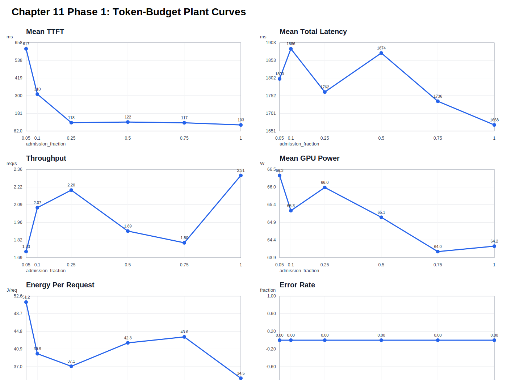

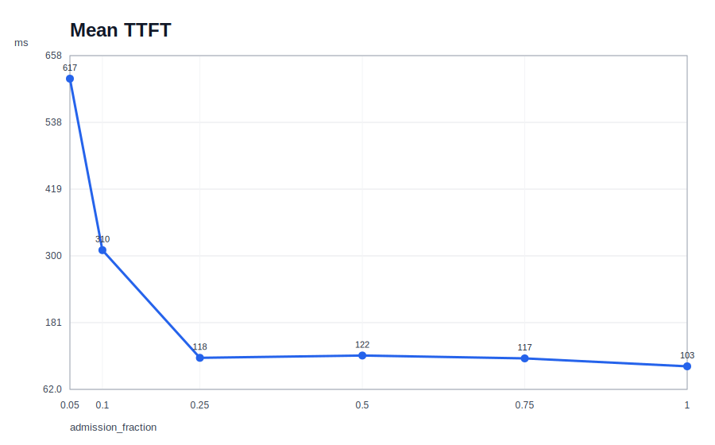

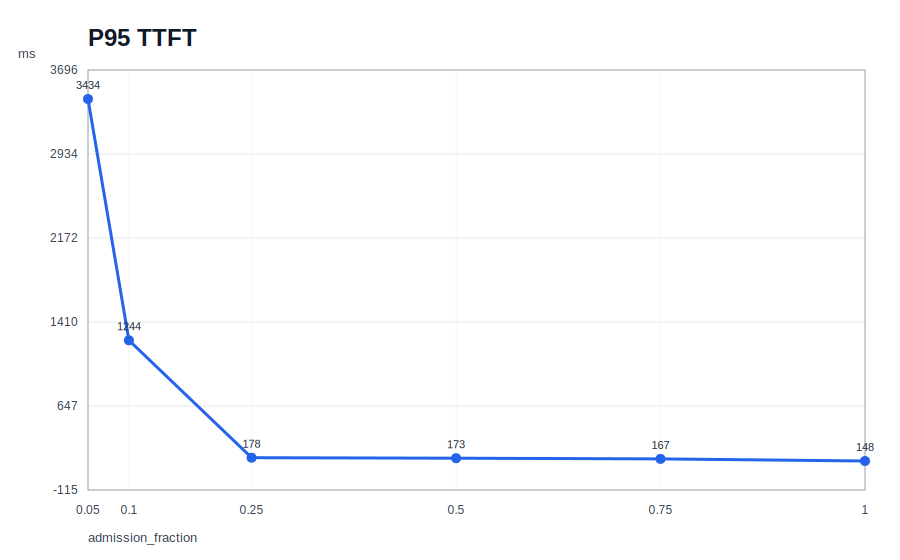

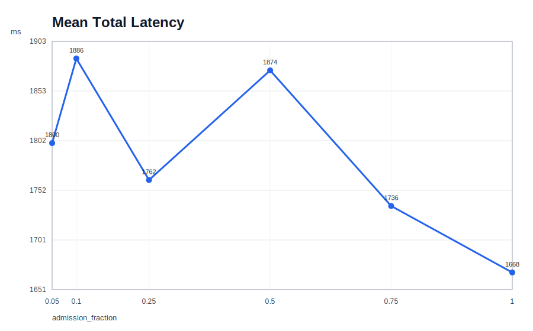

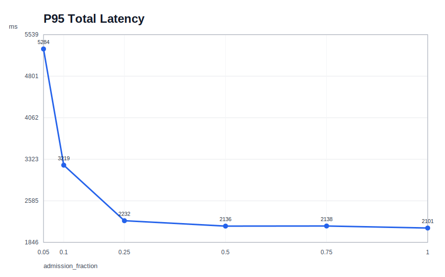

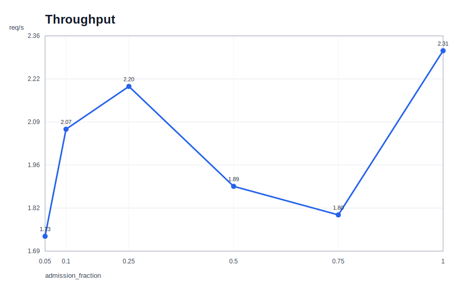

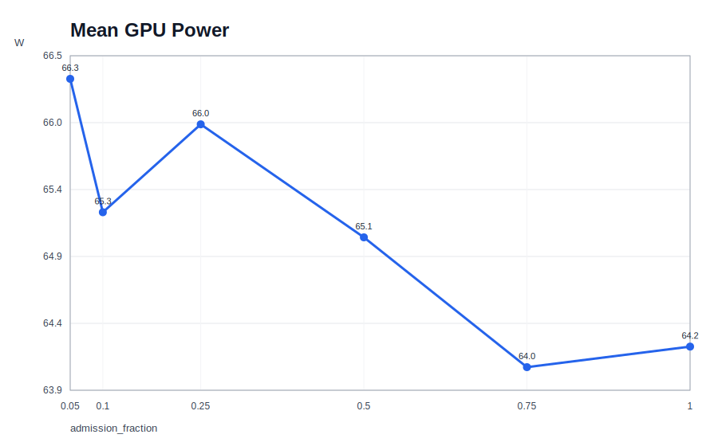

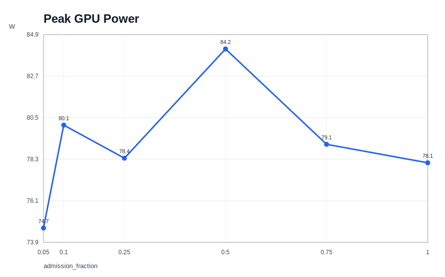

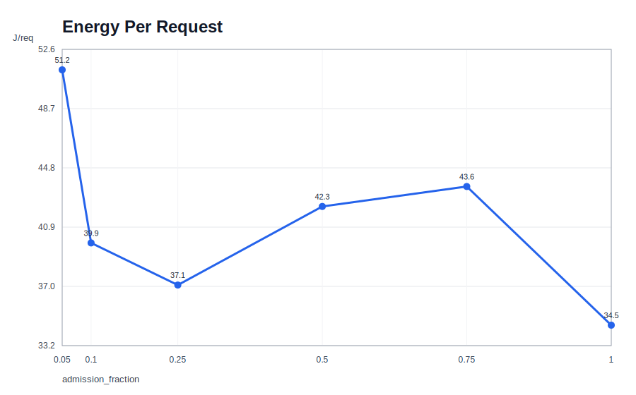

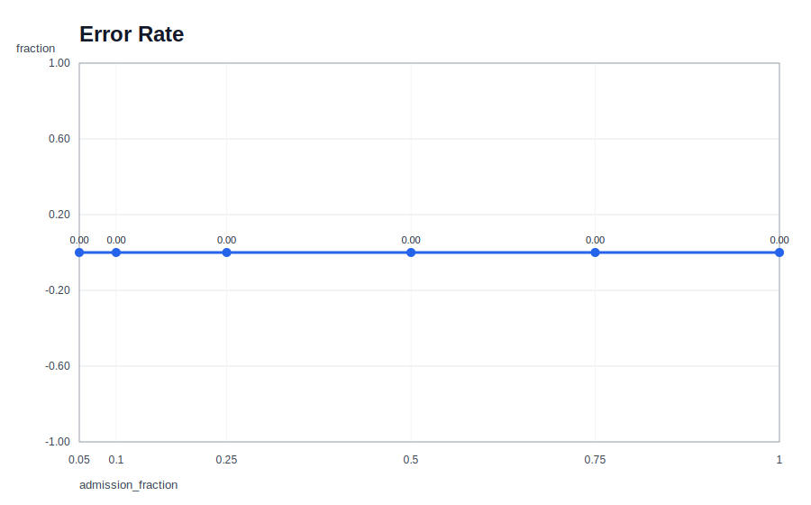

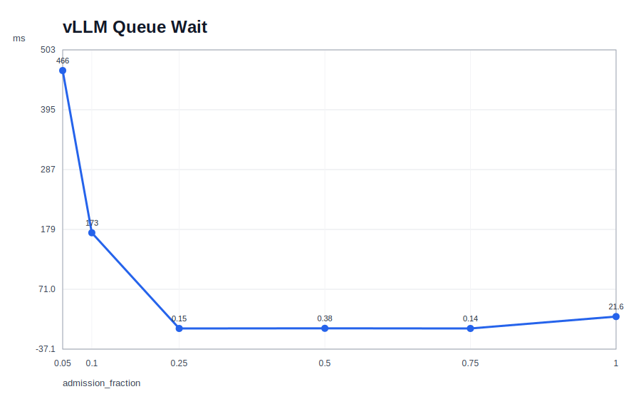

Headline result:

```text
frac   TTFT mean   TTFT p95    throughput   power mean   energy/req
1.00   103 ms      148 ms      2.31 req/s   64.2 W       34.5 J
0.75   117 ms      167 ms      1.80 req/s   64.0 W       43.6 J
0.50   122 ms      173 ms      1.89 req/s   65.1 W       42.3 J
0.25   118 ms      178 ms      2.20 req/s   66.0 W       37.1 J
0.10   310 ms      1244 ms     2.07 req/s   65.3 W       39.9 J
0.05   617 ms      3434 ms     1.73 req/s   66.3 W       51.2 J
```

---

### Phase 2: Closed-loop TTFT control — dispatch-delay actuator ✓

PI controller with TTFT as measured variable and dispatch delay as actuator.

#### Why dispatch-delay, not token-budget?

The token-budget actuator has **load-dependent authority**: at qps=8 with the
fraction floor at 0.01, it could only raise TTFT to ~170ms. Targets of 300ms+
are unreachable because no queue pre-exists when the controller starts from
fraction=1.0. The Phase 1 data showing 310ms at fraction=0.10 was a
transient queue artifact — not achievable in steady-state.

Dispatch-delay solves this directly:
- **Plant**: `delay↑ → TTFT↑` (positive, linear, no queue dynamics)
- **Authority**: TTFT = dispatch_delay + natural_prefill (~130ms); unlimited upside
- **No vLLM coupling**: scheduler stays in open_loop at fraction=1.0

#### Phase 2 gain tuning (kp=0.05, ki=0.005)

This worked at qps=8 (0.625s effective feedback lag), but oscillated
at qps=4 due to the longer lag. Phase 3 corrects this.

#### Phase 2 results (dispatch-delay, qps=8, kp=0.05, ki=0.005, ttft_window=10)

| Target | Mean   | p95    | Error |
|--------|--------|--------|-------|
| 200ms  | 203ms  | 242ms  | 0%    |
| 350ms  | 349ms  | 393ms  | 0%    |
| 500ms  | 498ms  | 545ms  | 0%    |

---

### Phase 3: Load-step disturbance rejection ✓

Demonstrates that the PI controller maintains its TTFT setpoint when arrival
rate is stepped (qps=4 → 8 → 4). Three targets are tested in a single chained
experiment, showing re-settling transients between setpoints.

#### Controller gain analysis

The effective feedback lag combines dead time and moving-average filter lag:

```
τ_dead  = window / (2 × qps)
τ_MA    = (window - 1) / 2 × (1 / qps)    ← MA filter group delay
τ_total = τ_dead + τ_MA

At qps=4, window=10:
  τ_dead  = 10 / 8  = 1.250s
  τ_MA    = 9/2 × (1/4) = 1.125s
  τ_total = 2.375s

Phase margin:
  PM = 180° - 90° - kp × feedback_rate × τ_total × (180/π)

  kp=0.05 → ω_gc=0.50 rad/s → PM = 22°  (oscillatory, 13s limit cycle)
  kp=0.03 → ω_gc=0.30 rad/s → PM = 49°  (well-damped)  ✓
  kp=0.02 → ω_gc=0.20 rad/s → PM = 63°  (conservative)
```

Stable gain rule: `kp < π / (2 × τ_total × feedback_rate)`.
For PM > 45°: kp ≤ 0.033 at these settings.

#### Chained multi-target experiment

All three targets are sent in a single HTTP POST to keep the total run time
below Modal's ~15-minute proxy timeout. The server executes them sequentially
with shared PI state — the controller re-settles to each new setpoint without
re-initialising, producing one continuous timeseries with visible setpoint
transitions.

```bash
python3 chapter_11/python/run_load_step.py \
  --url https://hvasudevan--chapter-11-token-budget-serve.modal.run \
  --target-ttft-ms 200 350 500 \
  --kp 0.03 --ki 0.002 \
  --ttft-window 10 --feedback-period-s 0.1 \
  --warmup-qps 4 --warmup-s 20
```

#### Phase 3 results

Run: `python/results/load_step_20260517_212627`
Gains: kp=0.03, ki=0.002, window=10, feedback_period=0.1s
Load steps: qps=4 (60s) → qps=8 (60s) → qps=4 (60s) per target

| Target | QPS | Mean    | p95     | Std    |
|--------|-----|---------|---------|--------|
| 200ms  | 4   | 198.4ms | 268.5ms | 41.4ms |
| 200ms  | 8   | 200.6ms | 220.2ms | 12.0ms |
| 200ms  | 4   | 200.9ms | 230.8ms | 16.9ms |
| 350ms  | 4   | 351.8ms | 437.3ms | 49.6ms |
| 350ms  | 8   | 348.9ms | 364.8ms | 10.7ms |
| 350ms  | 4   | 351.0ms | 375.8ms | 17.9ms |
| 500ms  | 4   | 502.1ms | 598.0ms | 49.9ms |
| 500ms  | 8   | 499.9ms | 520.4ms | 13.3ms |
| 500ms  | 4   | 499.5ms | 528.6ms | 20.0ms |

Means are within 2ms of the setpoint across all load levels and targets.
Std drops 3–4× when load doubles (qps=4→8) because more completions per
MA window give a tighter rolling estimate.

#### Phase 3 subplot (MATLAB-generated)

Three-panel subplot (one column per target, three load steps per column).
Rows: load (req/s) · TTFT with step-function setpoint reference ·
dispatch delay.

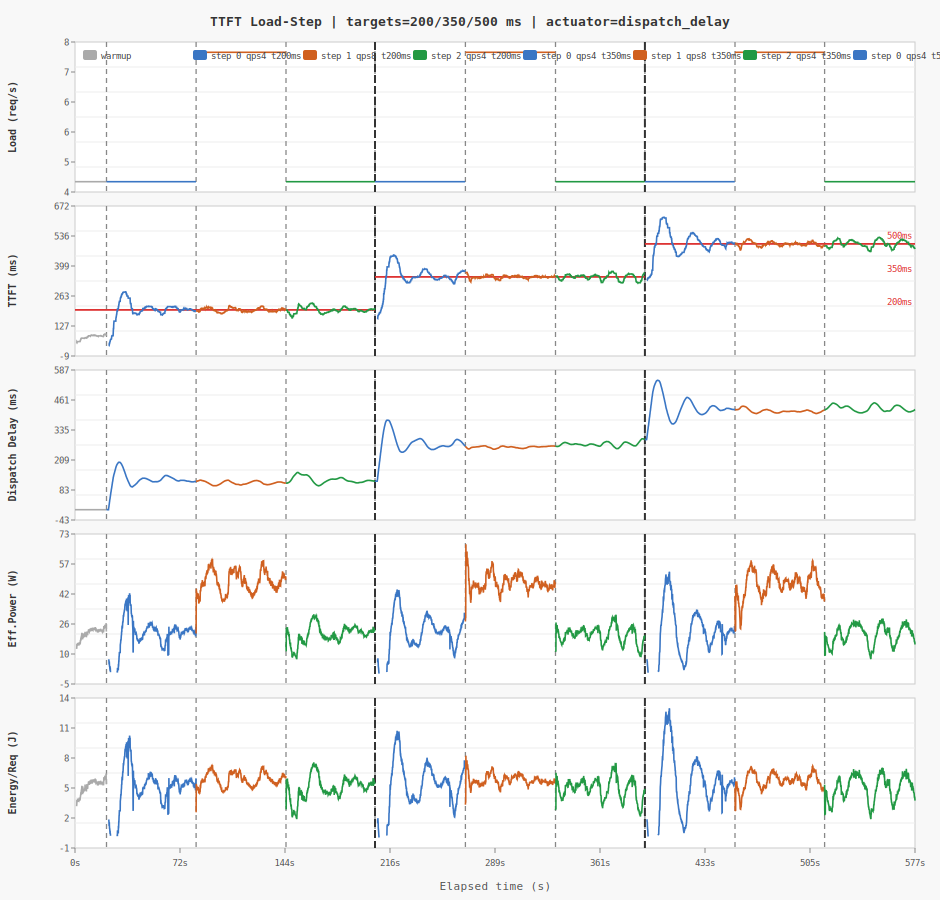

#### Phase 3 QA replay video

The video replays the scrolling chat at 5× speed alongside live TTFT,
QPS, and dispatch-delay traces with a real-time cursor.

[qa_video.mp4](python/results/load_step_20260517_212627/qa_video.mp4) — 5× speed, 30 fps, ~2 min

To regenerate:

```bash
python3 chapter_11/python/make_video.py \
  python/results/load_step_20260517_212627 --speed 5
```

---

### Phase 4: Constant-power controller (future)

PI controller with GPU power as measured variable and admission_fraction
as actuator. NVML polling infrastructure is already in place in the wrapper.

---

## GPU Utilization — Work in Progress

At the load levels used in Phase 2 and 3 (qps=4–8, Qwen2.5-3B on T4), the
GPU reports ~95–100% utilization regardless of dispatch delay.

This is a **memory-bandwidth floor**: the T4 must continuously stream the
full 3B parameter weights (~6GB in fp16) through HBM to generate each token.
Dispatch delay spaces out *requests*, but doesn't reduce the per-token work
during active generation. The GPU is always busy once a token is being generated.

Utilization only drops below this floor at very low load (<0.5 req/s), where
the GPU is genuinely idle between requests.

Making GPU utilization a useful controlled variable would require:
- Multi-GPU weight sharding (reduce per-GPU bandwidth demand)
- Quantization (reduce weight footprint → lower bandwidth)
- Or regulating *arrival rate* itself rather than per-request delay

This is noted as work in progress. The power controller (Phase 4) may be a
better proxy for GPU load than raw utilization percentage.

---

## Model & Hardware

- **Model**: Qwen/Qwen2.5-3B-Instruct
- **GPU**: NVIDIA T4 (16GB) on Modal
- **vLLM**: 0.16.x, v1 engine
- **Scheduler**: custom via `--scheduler-cls`
