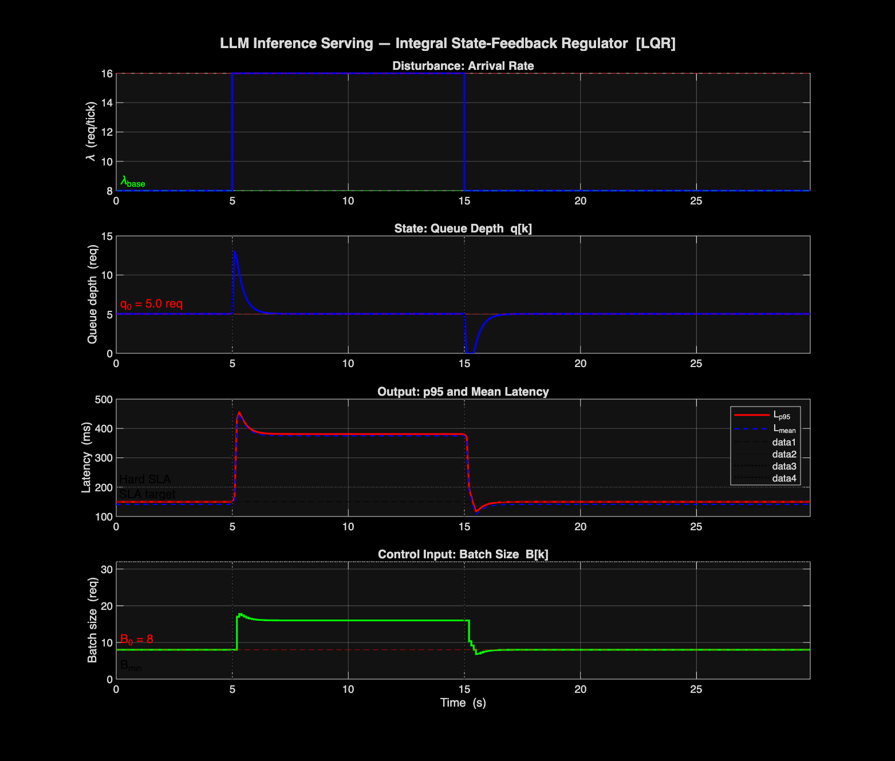
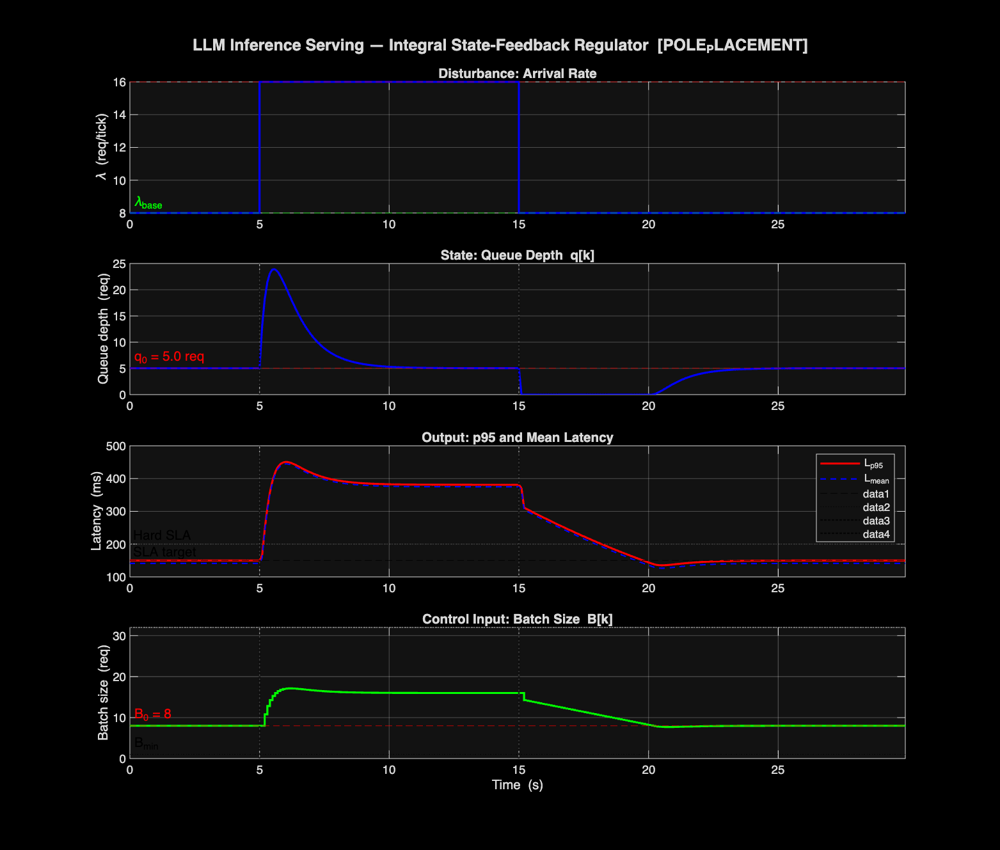

# Chapter 2a — Simulation: Cascade with Model-Based Integrator (Broke)

## What This Is

A variant of the Chapter 2 cascade that replaces the measurement-based
integrator with a model-based integrator. It breaks: the feedthrough term
causes integrator windup and the system latches to the wrong equilibrium.

This chapter exists to document a specific failure mode, not as a working
controller. The result plots show the windup behaviour.

## Prerequisites

- MATLAB R2024b or newer
- Control System Toolbox

## How to Run

The chapter was implemented directly in the simulation scripts. There is no
standalone entry point — the `resources/` folder contains the MATLAB project
file. Open it to reproduce the simulation:

```matlab
open('chapter_2a/llm_control.prj')
```

Or run the design scripts directly if you want to inspect what was tried:

```matlab
cd chapter_2a/resources
% open and inspect the scripts inside
```

## What You Will See

The integrator winds up and the system stabilises at the wrong operating
point. The two result plots show this clearly:





## Lesson

Integrate the **measured** error, not the **predicted** error. A model-based
integrator that accumulates what the model says the error *should* be will
diverge whenever the model has a non-zero feedthrough term. This is the
failure mode that Chapter 3 onward avoids.
