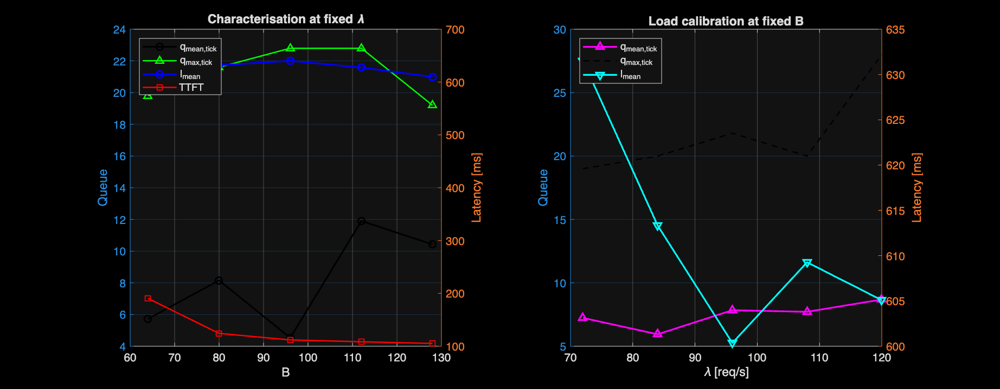
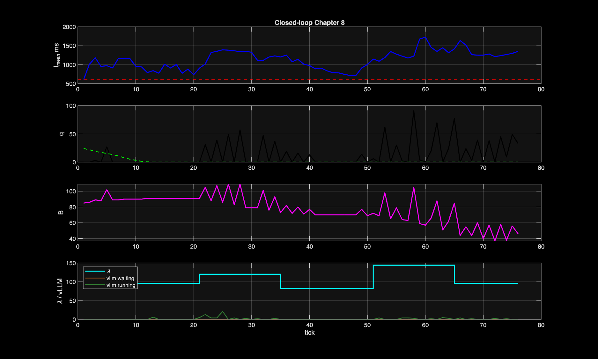

# Chapter 8 — MATLAB Cascade Control Over A Modal GPU Wrapper

Chapter 8 was an explicit attempt to recreate the Chapter 2 cascade
architecture on a real GPU-backed LLM service.

The plant for this chapter was:

`MATLAB controller -> Modal wrapper queue server -> local vLLM -> GPU`

The wrapper was introduced because native vLLM does not expose a clean
per-tick batch-size actuator. The wrapper therefore:

- accepted requests from MATLAB,
- stored them in a software FIFO queue,
- dispatched exactly `B` requests per tick into vLLM,
- exposed queue and latency metrics back to MATLAB.

The chapter goal was:

1. identify the plant from MATLAB,
2. design the cascade controller in MATLAB,
3. run closed-loop control from MATLAB,
4. test both steady and spiky load,
5. regulate `l_mean`.

## Final conclusion

The wrapper queue experiment was valuable, but it does **not** support the
Chapter 2 cascade story strongly enough at the top level of LLM serving.

What worked:

- MATLAB successfully controlled a real remote GPU experiment end to end.
- The Modal wrapper exposed a real software queue and per-tick dispatch.
- We obtained meaningful queue traces, latency traces, and actuator motion.
- The chapter clarified exactly where the Chapter 2 assumptions break.

What failed:

- the outer-loop identification from queue to mean latency was not physically
  consistent,
- the closed-loop cascade run did not regulate `l_mean` to target,
- the top-level LLM latency signal remained too entangled with batching,
  scheduler timing, and request-level variability.

The key identification result was:

```text
[fit] q_mean(B) = 0.0822 * B + 0.2580
[fit] beta_q=0.5000 queue_units_per_batch
[fit] l_mean(q_mean) = -4.9228 * q + 648.7647
[fit] beta_l=1.0000 latency_ms_per_queue_unit
```

The first line is usable as a rough software-queue sensitivity. The second
fit is the critical problem: a **negative** `l_mean(q)` slope is not a
credible physical queueing law for this plant. That means the outer-loop fit
is contaminated by confounding effects rather than exposing a true
`q -> l_mean` relation.

So Chapter 8 closes with the following conclusion:

- the Chapter 1/2 equations are better interpreted as **lower-level service
  node / batching equations**, not as whole-LLM API latency equations,
- a top-level HTTP LLM serving experiment is too aggregated to cleanly expose
  the Chapter 2 cascade plant,
- the correct next step is to move to a **lower-level GPU batching
  experiment** where `B` is a direct actuator and the queue/service equations
  are observable.

That pivot becomes Chapter 9.

## Folder layout

- `modal_vllm_wrapper.py`
  Modal deployment entrypoint. Starts vLLM and the Chapter 8 wrapper server in
  the same GPU container.
- `remote/vllm_modal_wrapper.py`
  HTTP wrapper server with FIFO queue, per-tick batch dispatch, metrics, and
  verbose trace logging.
- `matlab/characterise_plant.m`
  MATLAB plant identification script.
- `matlab/design_controller.m`
  MATLAB cascade controller design script.
- `matlab/run_cascade_controller.m`
  MATLAB closed-loop run with steady and spiky arrival-rate segments.

## What was added during identification

The later Chapter 8 revision added two important changes to make the plant as
close as possible to Chapter 2:

- arrivals were spread across each control interval instead of being injected
  as a single burst,
- the wrapper reported per-tick queue summaries such as `q_mean_tick`,
  `q_max_tick`, `arrivals_tick`, `completions_tick`, and `service_rate_tick`.

This improved the experiment substantially, but still did not recover a clean
positive outer relation from queue to mean latency.

## Result plots

Characterisation:



Closed-loop run:



The closed-loop plot is useful precisely because it shows the limitation:

- the controller moves `B`,
- the wrapper queue responds,
- but `l_mean` does not settle onto a stable regulated trajectory consistent
  with Chapter 2.

## Runtime tracing

This chapter is intentionally noisy at runtime. The traces include:

- MATLAB side:
  - each HTTP request sent to Modal,
  - each reply received,
  - arrivals per tick,
  - queue and latency observations,
  - controller state and commanded `B`.
- Modal side:
  - each request received from the client,
  - prompt previews and payload summaries,
  - enqueue and dispatch timestamps,
  - queue size and approximate lambda,
  - TTFT, queue wait, end-to-end latency,
  - native vLLM metric snapshots.

## Hugging Face fast downloads

The Modal image installs `huggingface_hub[hf_xet]` and sets:

- `HF_XET_HIGH_PERFORMANCE=1`

That is the current preferred Hugging Face fast-transfer path. If a future
stack still logs the legacy `hf_transfer` message, install
`huggingface_hub[hf_transfer]` and set `HF_HUB_ENABLE_HF_TRANSFER=1`.

## Prerequisites

- MATLAB R2024b or newer with Control System Toolbox
- Python 3.11+ with a Modal account
- Modal CLI installed and authenticated (see root README for one-time setup)

## How to Run

### 1. Deploy to Modal

From the repository root:

```bash
source .modal-venv/bin/activate     # activate the shared Modal venv
modal deploy chapter_8/modal_vllm_wrapper.py
```

Modal prints a URL like `https://hvasudevan--chapter-8-vllm-wrapper.modal.run`.

Wait for the health check:

```bash
curl https://YOUR-ENDPOINT/health
```

### 2. Set the URL in MATLAB

```matlab
setenv('CH8_SERVER', 'https://YOUR-ENDPOINT.modal.run')
```

### 3. Run the MATLAB experiment

```matlab
cd chapter_8/matlab
characterise_plant        % sweeps B, identifies q_mean(B) and l_mean(q)
design_controller         % fits slopes, computes cascade gains
run_cascade_controller    % closed-loop run with steady + spiky load
```

Each script reads `CH8_SERVER` from the environment. Results are saved as
`.mat` files and plots (`ch8_characterise.png`, `ch8_closed_loop.png`) in
`chapter_8/matlab/`.

### 4. Tail logs

```bash
modal app logs chapter-8-vllm-wrapper
```

### 5. Tear down

```bash
modal app stop chapter-8-vllm-wrapper
```

## Expected Outcome

`characterise_plant` produces a negative outer slope (`l_mean = -4.9·q + 649`).
That is the failure indicator — a negative `q → l_mean` relationship is not a
credible queueing law. The cascade cannot regulate latency at the top-level
LLM API layer.

## Chapter 9 handoff

Chapter 9 should pivot to a lower-level experiment where the Chapter 2 plant
is physically meaningful.

Recommended Chapter 9 setup:

- offline or semi-offline batched transformer inference on GPU,
- fixed model, fixed prompt length, fixed output length,
- software queue outside the model runtime,
- exact batch-size control `B[k]`,
- explicit measurement of queue, batch service time, and job completion
  latency.

That experiment should model:

- inner loop: `B -> q`
- outer loop: `q -> l_mean`

with much less contamination from network, request streaming, and opaque
runtime scheduling.

Suggested Chapter 9 kickoff text:

```text
Chapter 8 showed that a top-level LLM serving experiment on Modal + vLLM,
even with a wrapper queue, does not cleanly expose the Chapter 2 cascade
plant. We identified a weak positive B->q relation but an unphysical negative
q->l_mean fit, so the next step is to move down one level.

For Chapter 9, design a lower-level GPU batching experiment where batch size
B is a direct actuator, queue length is a true plant state, and service time
is measured per batch. Start by proposing the architecture, state/update
equations, logging plan, and MATLAB/Python split for that experiment.
```
